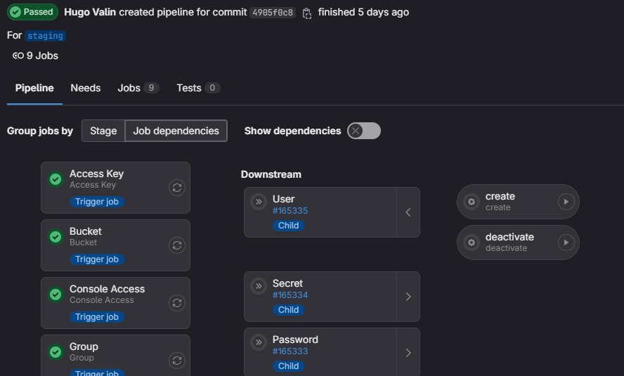
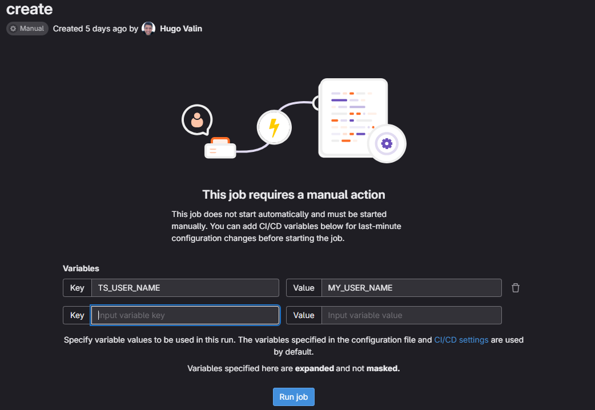

# Terraform User Management Repository

This Terraform repository provides infrastructure as code (IaC) to automate user management tasks within a cloud environment.
The primary objectives include creating/deactivating a user, generating an access key, and resetting passwords.

## Table of Contents

- [Introduction](#introduction)
- [Features](#features)
- [Pipeline](#pipeline)
- [Terraform](#terraform)
- [Contributing](#contributing)
- [License](#license)

## Introduction

Managing users in a cloud environment can be a repetitive and error-prone task.
This Terraform repository aims to automate and streamline the process of user management, providing a consistent and auditable approach to handling access credentials.

## Features

- **User Creation/Deactivation**: Easily create and deactivate users within your cloud environment.
- **Access Key Generation**: Automatically generate access keys for users to interact with cloud resources programmatically.
- **Password Reset**: Implement password reset functionality for enhanced security.

## Pipeline

### Run
To execute the pipeline:

1. On the left sidebar, select **Search or go to** and find your project.
2. Select **Build > Pipelines**.
3. Select **Run pipeline**.
4. In the **Run for branch name or tag** field, select the branch or tag to run the pipeline for.
5. Enter any CI/CD variables required for the pipeline to run.
6. Select **Run pipeline**.
7. The pipeline now executes the jobs as configured.

### Use cases and variables
When running the pipeline, several options are shown, each one referring to a resource that you can modify/create/remove. For example, running the pipeline will display the following options:

- Access Key
- Bucket
- Console Access
- Maintenance
- Parameter
- Password
- Secret
- User

Once the resource has been selected, it is necessary to select the operation that will be performed. For example, by selecting the User resource, we can activate or deactivate a user, as shown in the image below.



Suppose we want to create a user, we need to fill in some information about creating the user, for example the name. Therefore, we have to place the following variable `TS_USER_NAME`, as shown in the image below.



Here is a list of the relationship between the use case and the parameters required for its execution.

#### Access Key
- `TS_ACCESS_KEY_ID`: The access key id
- `TS_USER_NAME`: The user name

#### Bucket
- `TS_BUCKET_NAME`: The bucket name

#### Console Access
- `TS_USER_NAME`: The user name

#### Domain (ElasticSearch/Opensearch)
- `TS_DOMAIN_NAME`: The domain name

#### Group
- `TS_USER_NAME`: The user name
- `TS_GROUP_NAME`: The group name

#### Maintenance (ECS)
- `TS_CLUSTER_NAME`: The cluster name
- `TS_SERVICE_NAME`: The service name

#### Parameter
- `TS_PARAMETER_NAME`: The parameter name
- `TS_PARAMETER_VALUE`: The parameter value

#### Password
- `TS_USER_NAME`: The user name

#### Secret
- `TS_SECRET_NAME`: The secret name
- `TS_SECRET_KEY`: The secret key
- `TS_SECRET_VALUE`: The secret value

#### User
- `TS_USER_NAME`: The user name

## Terraform

### Module

Every terraform module follows the following pattern.

```
terraform/my-module/
├── main.tf               # Main Terraform configuration file
├── variables.tf          # Variable declarations
└── outputs.tf            # Output configurations
```

## Variables and Outputs

#### Module: Access Key

| Variable | Description                                      | Type   | Default |
|----------|--------------------------------------------------|--------|---------|
| user     | IAM user to associate with this access key       | string |         |
| pgp_key  | For use in the encrypted_secret output attribute | string | null    |
| status   | Path in which to create the group                | string | null    |

| Output                          | Description                                                           | Sensitive |
|---------------------------------|-----------------------------------------------------------------------|-----------|
| create_date                     | Date and time in RFC3339 format that the access key was created       | false     |
| encrypted_secret                | Encrypted secret, base64 encoded, if pgp_key was specified            | false     |
| encrypted_ses_smtp_password_v4  | Encrypted SES SMTP password, base64 encoded, if pgp_key was specified | false     |
| id                              | Access key ID                                                         | false     |
| key_fingerprint                 | Fingerprint of the PGP key used to encrypt the secret                 | false     |
| secret                          | Secret access key                                                     | true      |
| ses_smtp_password_v4            | Secret access key converted into an SES SMTP password                 | true      |

#### Module: Bucket

| Variable      | Description                                                                | Type   | Default |
|---------------|----------------------------------------------------------------------------|--------|---------|
| bucket        | Name of the bucket                                                         | string |         |
| force_destroy | All objects should be deleted from the bucket when the bucket is destroyed | string | true    |

| Output | Description                       | Sensitive |
|--------|-----------------------------------|-----------|
| id     | Name of the bucket                | true      |
| arn    | ARN of the bucket                 | false     |
| region | AWS region this bucket resides in | false     |

#### Module: Group

| Variable | Description                       | Type   | Default |
|----------|-----------------------------------|--------|---------|
| name     | The group's name                  | string |         |
| path     | Path in which to create the group | string | /       |

| Output     | Description                           | Sensitive |
|------------|---------------------------------------|-----------|
| id         | The group's name                      | false     |
| arn        | The ARN assigned by AWS for this user | false     |
| name       | The group's name                      | false     |
| path       | The path of the group in IAM          | false     |
| unique_id  | The unique ID assigned by AWS         | false     |

#### Module: Group Membership

| Variable | Description                                | Type   | Default |
|----------|--------------------------------------------|--------|---------|
| name     | The name to identify the Group Membership  | string |         |
| user     | A user name to associate with the Group    | string | []      |
| group    | A user name to associate with the Group    | string | null    |

| Output  | Description                                | Sensitive |
|---------|--------------------------------------------|-----------|
| name    | The name to identify the Group Membership  | false     |
| users   | A list of IAM User names                   | false     |
| group   | IAM Group name                             | false     |

#### Module: User

| Variable             | Description                                                                                | Type     | Default |
|----------------------|--------------------------------------------------------------------------------------------|----------|---------|
| name                 | The user's name                                                                            | string   |         |
| path                 | Path in which to create the user                                                           | string   | /       |
| permissions_boundary | The ARN of the policy that is used to set the permissions boundary for the user            | string   | null    |
| force_destroy        | Destroy even if it has non-Terraform-managed IAM access keys, login profile or MFA devices | bool     | true    |
| tags                 | Key-value map of tags for the IAM user                                                     | map(any) | null    |

| Output    | Description                            | Sensitive |
|-----------|----------------------------------------|-----------|
| arn       | The ARN assigned by AWS for this user  | false     |
| id        | The user's name                        | false     |
| name      | The user's name                        | false     |
| tags_all  | A map of tags assigned to the resource | false     |
| unique_id | The unique ID assigned by AWS          | false     |

#### Module: Password

| Variable                | Description                                                                            | Type   | Default |
|-------------------------|----------------------------------------------------------------------------------------|--------|---------|
| user                    | The IAM user's name                                                                    | string |         |
| pgp_key                 | Either a base-64 encoded PGP public key                                                | string | null    |
| password_length         | The length of the generated password on resource creation                              | number | 20      |
| password_reset_required | Whether the user should be forced to reset the generated password on resource creation | bool   | true    |

| Output             | Description                                                 | Sensitive |
|--------------------|-------------------------------------------------------------|-----------|
| password           | The plain text password                                     | true      |
| key_fingerprint    | The fingerprint of the PGP key used to encrypt the password | false     |
| encrypted_password | The encrypted password, base64 encoded                      | false     |

#### Module: Secret

| Variable       | Description                                                                          | Type   | Default |
|----------------|--------------------------------------------------------------------------------------|--------|---------|
| name           | The secret's name                                                                    | string |         |
| secret_string  | Specifies text data that you want to encrypt and store in this version of the secret | string | null    |

| Output        | Description                                                                           | Sensitive |
|---------------|---------------------------------------------------------------------------------------|-----------|
| arn           | The ARN of the secret                                                                 | false     |
| id            | A pipe delimited combination of secret ID and version ID                              | false     |
| secret_string | Specifies text data that you want to encrypt and store in this version of the secret  | false     |

#### Module: Parameter

| Variable | Description            | Type   | Default      |
|----------|------------------------|--------|--------------|
| name     | Name of the parameter  | string |              |
| type     | Type of the parameter  | string | SecureString |
| value    | Value of the parameter | number |              |

| Output    | Description                          | Sensitive |
|-----------|--------------------------------------|-----------|
| arn       | ARN of the parameter                 | false     |
| tags_all  | Map of tags assigned to the resource | false     |
| version   | Version of the parameter             | false     |

## Contributing

Feel free to contribute to this repository by creating issues, proposing new features, or submitting pull requests.

## License

This Terraform User Management Repository is licensed under the [MIT License](LICENSE).
